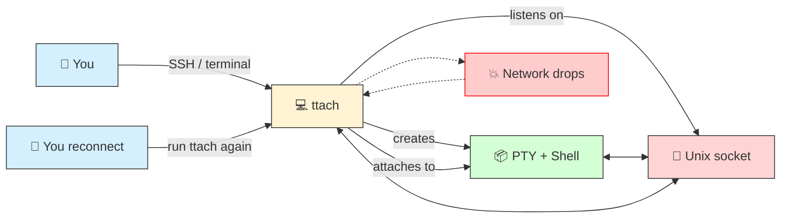
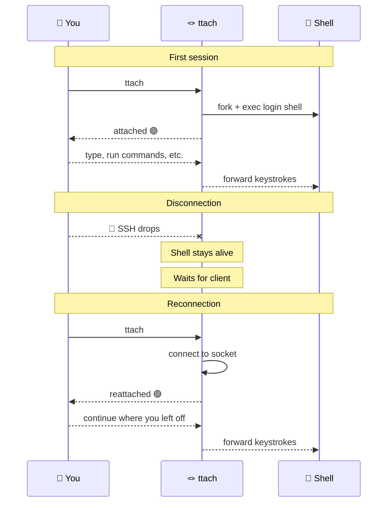

<p align="center">
  <h1 align="center">🪢 ttach</h1>
  <p align="center"><i>Resume your shell after SSH or terminal disconnection — nothing else.</i></p>
</p>

<p align="center">
  <a href="https://github.com/tayyebi/ttach/releases/latest">
    
  </a>
  <a href="LICENSE">
    
  </a>
  <a href="https://github.com/tayyebi/ttach/actions/workflows/release.yml">
    
  </a>
  
  
  
</p>

---

## ✨ What is `ttach`?

**ttach** is the smallest utility that does exactly **one thing**:

> 💬 *"Reconnect me to the shell I was using before the network disappeared."*

It is **not** tmux. It is **not** screen. It is **not** a terminal multiplexer.

No panes. No windows. No tabs. No scrollback. No config files. No plugins.



---

## 🚀 Quick Start

### ⬇️ Download

| Platform | Download |
|----------|----------|
| 🐧 **Linux** (x86_64) | [`ttach-linux`](https://github.com/tayyebi/ttach/releases/download/v1.0.0-alpha/ttach-linux) |
| 🪟 **Windows** (x86_64) | [`ttach-windows.exe`](https://github.com/tayyebi/ttach/releases/download/v1.0.0-alpha/ttach-windows.exe) |

> ⚡ Binaries are built automatically on every [release](https://github.com/tayyebi/ttach/releases). For the latest, grab from the newest release.

### 🐧 Linux

```bash
# Download
curl -LO https://github.com/tayyebi/ttach/releases/download/v1.0.0-alpha/ttach-linux

# Make executable
chmod +x ttach-linux

# (optional) Install system-wide
sudo mv ttach-linux /usr/local/bin/ttach
```

### 🪟 Windows

Download `ttach-windows.exe` and place it somewhere in your `PATH`, or run it directly from a terminal.

### ▶️ Usage

```bash
# First time — start a session
ttach

# Disconnect (SSH drops / terminal closes / network fails)
# ... any time later ...

# Reconnect — same command, same shell
ttach
```

That's it. No arguments. No flags. No session names.



---

## 🧠 How It Works

```mermaid
flowchart TB
    subgraph server["🪢 ttach server (long-running process)"]
        PTY["📦 PTY master"]
        SHELL["🐚 Shell (bash/zsh/...)」]
        SOCK["🔌 Unix domain socket"]
        RELAY["🔄 poll() relay loop"]
        PTY <--> RELAY
        SOCK <--> RELAY
        PTY --> SHELL
    end

    subgraph client["🪢 ttach client (short-lived)"]
        CLI_PTY["💻 Your terminal"]
        CLIENT_RELAY["🔄 poll() relay loop"]
        CLI_PTY <--> CLIENT_RELAY
    end

    client -- "4-byte handshake (window size)" --> server
    client -- "keystrokes →" --> server
    server -- "shell output →" --> client

    style server fill:#fff3d4,stroke:#333
    style client fill:#d4f0ff,stroke:#333
```

**Core architecture — step by step:**

1. **Server starts** — creates a PTY (pseudo-terminal), forks, and executes your login shell inside it
2. **Socket** — opens a Unix domain socket at `$XDG_RUNTIME_DIR/ttach.sock` (fallback: `/tmp/ttach-<uid>.sock`)
3. **Wait** — blocks on `accept()` for a client connection
4. **Client connects** — sends the terminal window size (4-byte handshake), then enters raw mode
5. **Relay** — `poll()` forwards bytes bidirectionally between your terminal and the PTY:
   - Your keystrokes → socket → PTY → shell
   - Shell output → PTY → socket → your terminal
6. **Disconnect** — client disappears; server keeps the shell alive and returns to step 3
7. **Reconnect** — another `ttach` invocation connects, handshakes, relay resumes

---

## 📋 When to use `ttach` vs `tmux` / `screen` / `dtach`

| Need | `ttach` | `tmux` | `screen` | `dtach` |
|------|---------|--------|----------|---------|
| Reconnect after SSH drop | ✅ | ✅ | ✅ | ✅ |
| Multiple windows/panes | ❌ | ✅ | ✅ | ❌ |
| Scrollback buffer | ❌ | ✅ | ✅ | ❌ |
| Session sharing | ❌ | ✅ | ✅ | ❌ |
| Configuration files | ❌ | ✅ | ✅ | ❌ |
| Scripting/plugins | ❌ | ✅ | ✅ | ❌ |
| Binary size | **~30KB** | ~2MB | ~1MB | ~50KB |
| Zero-config attach | ✅ **yes** | ❌ `tmux attach` | ❌ `screen -r` | ❌ `dtach -a` |
| Lines of code | **~600** | ~300K | ~100K | ~8K |

> 🎯 **Use `ttach` when:** you want exactly one thing — reconnect to your lost shell — and don't need a full terminal multiplexer.

---

## 🛠️ Building from Source

### Requirements

- C99 compiler (GCC or Clang)
- `make`
- POSIX system (Linux, BSD, macOS)

### Build

```bash
git clone https://github.com/tayyebi/ttach.git
cd ttach
make
sudo make install
```

The build is warning-free under `-Wall -Wextra -Wpedantic -std=c99`.

---

## ⚙️ Technical Details

| Aspect | Choice |
|--------|--------|
| Language | **C99** — no extensions, no compiler-specific code |
| Dependencies | **Zero** — only libc and POSIX APIs |
| PTY | `forkpty()` — creates a new pseudo-terminal |
| Event loop | `poll()` — no busy-waiting, no threads |
| Signals | `SIGCHLD`, `SIGTERM`, `SIGWINCH` handled; `SIGHUP`, `SIGINT` ignored |
| Socket | `AF_UNIX` (`SOCK_STREAM`) — `$XDG_RUNTIME_DIR/ttach.sock` or `/tmp/ttach-<uid>.sock` |
| Window size | 4-byte handshake on client connect |

**Signal handling:**

| Signal | Behavior |
|--------|----------|
| `SIGCHLD` | Shell exited → clean up and exit |
| `SIGTERM` | Forward to shell, clean up, exit |
| `SIGWINCH` | Query terminal size, update PTY |
| `SIGHUP` | **Ignored** — survives terminal close |
| `SIGINT` | **Ignored** — passes through to shell |

---

## 📜 Philosophy

Every feature must justify its existence. If removing it makes the code smaller without breaking the core promise — *reconnect me to my shell* — then the feature should be removed.

> 🧘 **ttach is intentionally less capable than dtach.**

One user. One session. One shell. No configuration.

---

## 📄 License

[GPL-3.0](LICENSE)
